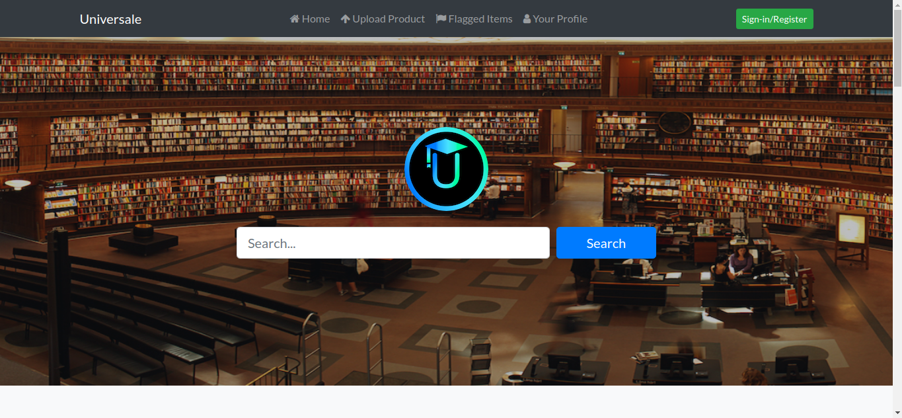

 

# Universale
A web app exclusively for college students to buy/sell items.Provides a simple, easy to use platform for students to find items/services of interest.  


## Requirements
- Python >= 3
- Django >= 2.0.2
- Django widget tweaks ***(pip3 install django-widget-tweaks)***

## Setup
To get the project up and running follow the steps below:

### Step 1
Navigate to the application.
```bash
$ cd $PROJECT_ROOT/Django
```
### Step 2
Start the server
```bash
$ python3 manage.py runserver
```
### Step 3
Open a browser and go to the following address:
[http://127.0.0.1:8000](http://127.0.0.1:8000)


## Current Capabilities
- Upload/Delete an item
- Flag/Un-flag an item
- Search for items
- Edit your profile

## License
The project is available under the **MIT** license. See the [license](https://github.com/vedantpuri/universale/blob/master/LICENSE.md) file for more informations.
